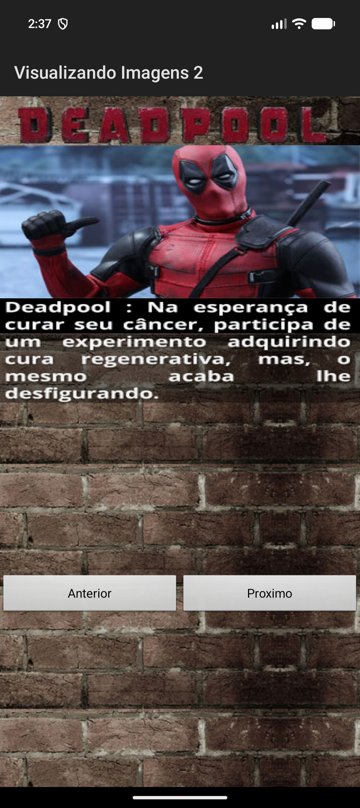
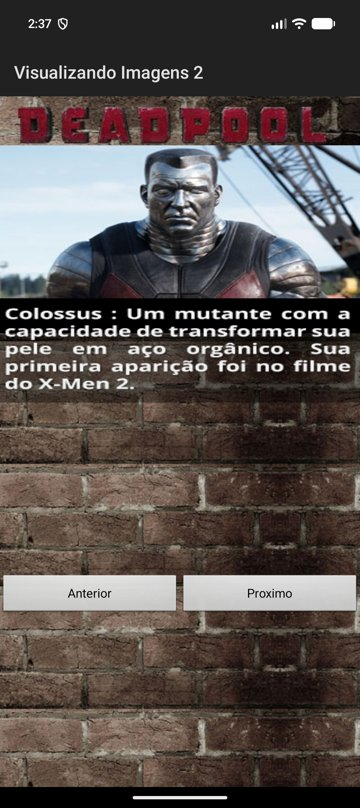
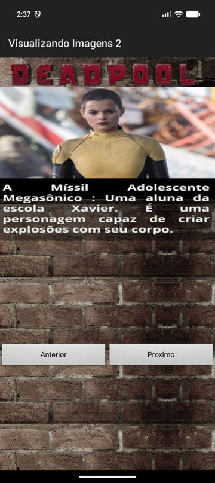
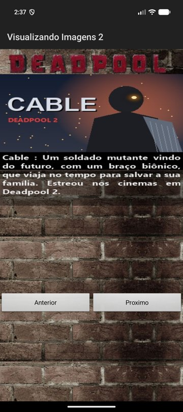

# Componentes de Imagens – Visualizando Imagens 2

Atividade da **Aula 7 – Componentes de Imagens: ImageView e ImageSwitcher** da disciplina de
**Desenvolvimento Mobile** (Prof. João Paulo Pimentel).

O app **Visualizando Imagens 2** mostra personagens do filme *Deadpool* usando dois
`ImageSwitcher`: um para a foto do personagem e outro para a frase de descrição. Os botões
**Anterior** e **Próximo** trocam o personagem com uma animação de transição.

### Exercício pedido

> Acrescentar mais uma imagem e a descrição sobre o personagem no segundo APP, ou seja, o APP vai
> mostrar 4 imagens e suas frases de descrições dos personagens.

O quarto personagem adicionado foi o **Cable** (Deadpool 2), com a foto `foto_cable.jpg` e a
frase `frase_sobre_cable.png`, no mesmo formato das imagens enviadas pelo professor.

## Telas

| 1 – Deadpool | 2 – Colossus | 3 – Míssil Adolescente Megasônico | 4 – Cable (exercício) |
|:---:|:---:|:---:|:---:|
|  |  |  |  |

## Como funciona

Arquivo principal: [`VisualizandoImagensActivity.java`](app/src/main/java/com/example/visualizandoimagens2/VisualizandoImagensActivity.java)

1. **ViewFactory**: antes de carregar uma imagem num `ImageSwitcher`, cada um precisa de uma
   `ViewFactory` (`setFactory`) que cria o `ImageView` interno. Sem ela o app fecha com erro ao
   chamar `setImageResource`.
2. **Animações**: `AnimationUtils.loadAnimation` carrega as animações nativas
   `android.R.anim.slide_in_left` (entrada) e `android.R.anim.slide_out_right` (saída), aplicadas
   com `setInAnimation` e `setOutAnimation`.
3. **Navegação**: a variável `indice` guarda o personagem atual (1 a 4). O botão **Próximo**
   incrementa até 4 e o **Anterior** decrementa até 1. Depois os dois chamam
   `mostrarInfoPersonagem()`.
4. **`mostrarInfoPersonagem()`**: um `switch (indice)` escolhe a foto e a frase de cada
   personagem. O `case 4` é o personagem novo do exercício:

```java
case 4:
{
    //Exercicio: quarto personagem
    imgFoto.setImageResource(R.drawable.foto_cable);
    imgSobre.setImageResource(R.drawable.frase_sobre_cable);

}break;
```

O botão Próximo passou de `indice < 3` para `indice < 4`.

## Estrutura

```
app/src/main/
├── AndroidManifest.xml
├── java/com/example/visualizandoimagens2/
│   └── VisualizandoImagensActivity.java
└── res/
    ├── drawable/
    │   ├── foto_deadpool.jpg      frase_sobre_deadpool.png
    │   ├── foto_colossus.jpg      frase_sobre_colossus.png
    │   ├── foto_megasonico.jpg    frase_sobre_megasonico.png
    │   ├── foto_cable.jpg         frase_sobre_cable.png      <- novo (exercício)
    │   ├── fundo_tela.jpg                                    <- fundo original do professor
    │   └── fundo_tela_ajustado.xml, fundo_topo.jpg, fundo_tijolo.jpg
    ├── layout/activity_visualizando_imagens.xml
    └── values/strings.xml, themes.xml
```

## Ajustes em relação ao material da aula

O XML e o código seguem os slides. Precisei mudar três coisas para o app ficar igual aos prints
da aula num celular atual (Android 15+):

- **Edge-to-edge**: nos Androids novos o app é desenhado atrás da barra de status e da barra de
  título. O layout do professor foi colocado dentro de um `FrameLayout` com
  `android:fitsSystemWindows="true"` para o conteúdo começar abaixo da barra.
- **Fundo da tela**: o XML da aula usa `tools:background`, que só aparece no preview do Android
  Studio. Troquei para `android:background`. Como o `fundo_tela.jpg` tem 320x480 e esticava
  numa tela grande, o fundo virou um `layer-list` (`fundo_tela_ajustado.xml`): o título
  "DEADPOOL" fica no topo e a parede de tijolos se repete até o fim da tela.
- **Largura das imagens**: na `ViewFactory` usei `MATCH_PARENT` em vez de `WRAP_CONTENT` para as
  imagens ocuparem a largura inteira da tela.

## Como executar

1. Abra a pasta do projeto no **Android Studio** (File > Open) e espere o Gradle sincronizar.
2. Escolha um emulador ou celular e clique em **Run ▶**.

Pelo terminal:

```bash
./gradlew installDebug
```

**Configuração:** Java, `minSdk 24`, `targetSdk/compileSdk 37`, Android Gradle Plugin 9.3.1,
Gradle 9.5.0. Não usa bibliotecas externas, só componentes nativos (`android.widget.*`).
